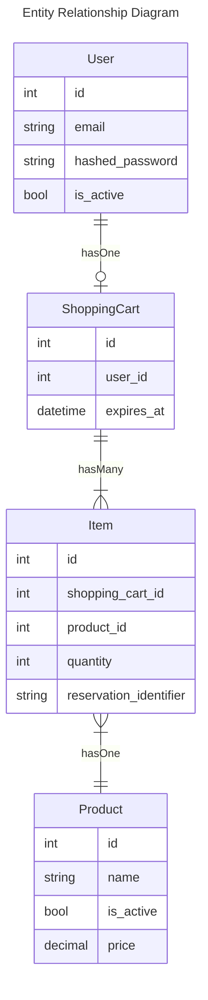

# Roche Code Challenge

## Installation & Setup
Run the following commands in order to configure the project:

`pip install -r requirements.txt` - to install the dependencies for the project

`uvicorn main:app --reload` - to start the FastAPI server so that you can view the documentation. Note that starting the server will also run create all the tables for the models inside the `roche_cc.db` SQLite file.

The API documentation can be access at `http://127.0.0.1:8000/docs#/`

## Technologies
- [FastAPI](https://fastapi.tiangolo.com) - used as the backbone for the application. It was chosen because it provided enough flexibility to build the API as one desires, but with enough utility in place to actually make things go a lot faster than writing from scratch. It came with automatic Swagger documentation based on typing, which is a huge plus. I could have used Django, but there is a lot from that framework that in my opinion is not written in a very usable or modern way.
- [Pydantic](https://docs.pydantic.dev/latest/) - was added to quickly define schema classes for the request and response payloads. It already plays nicely with FastAPI, so using it was a no brainer.
- [SQLAlchemy](https://www.sqlalchemy.org) - In this day and age writing raw SQL is simply not a good idea. Since we want the api to have a database, we also want the code to have an ORM to make DB interactions a little safer and more pleasant to write.
- [SQLite](https://www.sqlite.org/index.html) - Since this coding challenge is more of a proof of concept than anything else, using a simple database to save time was key. Should this actually be built for production, something like [MySQL](https://www.mysql.com) or [PostreSQL](https://www.postgresql.org) would have been used.
- [Arrow](https://arrow.readthedocs.io/en/latest/) - there were some date time operations I added as part of the code, and in order to make them much easier to do I ended up pulling in arrow as well.

## Code 

### DB Architecture



### Structure

The code is organized into modules that clearly describe what is contained within them. For a little more context these can be interpreted as:
- `api/controllers` - this is  where all the controllers registering the API routes and the overall endpoint orchestration resides. The `items_controller.py` module is where the main controller for this coding challenge is located.
- `api/database` - this is where you will find the configurations for the database connectivity, as well as the model definitions
- `api/jobs` - Job classes are defined as encapsulations of code that are meant to be placed on a queue and picked up by a worker servers, to be processed asynchronously. (Hint: think worker tasks in Djang/Celery)
- `api/services` - this is where service classes that encapsulate actions related to a specific context reside. Services allow code to be more re-usable but also far more single responsibility. Service classes aid in moving logic away from places it does not belong. (e.g. controllers shouldn't really be concerned with what happens behind the scenes)
- `api/validation` - this is where the Rule and Validator mechanisms reside. These mechanisms are used for implementing more robust request validation. The idea being that before the controllers decide to do anything with the data, it must be validated first.
- `tests` - as the name implies this is where the test suite for the api is.

### Style

You will notice that there isn't very many comments in my code. This is on purpose. I am a strong believer in writing self documented code. If one can't grasp what the code is doing just from reading the method and variable names and the order of operations, then the code is too complex or doing more than it should. I strongly believe code should be written with single responsibility in mind. Every method/function should do one thing, and one thing only. I reserve comments for areas where the code is straight forward to understand, but the business logic and context behind why that operation is done is not obvious. Typically, these comments would be more descriptive and take the form of large doc blocks. In my experience in a codebase following this strategy, when one does come across a large comment it typically peaks the engineers interest and the comment is read. While having doc blocks everywhere, as redundant as it may be, tends to cause engineers to completely glance over all of them and ignore them all together.

Additionally, I don't typically leave TODOs in my code, no one should really. It's a strong smell for incomplete code. In this case however certain aspects of the code base are not implemented at all due to time constraints. So some TODOs were left to describe the pseudo code of what should be implemented in their place.

Why is the item list endpoint called `index`? Because the word `list` is reserved as a type in python, and shouldn't be used to name methods. Django does this, and trust me it causes havoc, and confusion everywhere. "Index" is actually the more correct word to use for an endpoint that will return all entities of a given type.

### Endpoint Implementation

My belief is that any API endpoint should go through the following request flow:
```
Request -> Authentication -> Authorization -> Validation -> Processing -> Formatting -> Response
```
More often than not however I see API's being implemented by omitting the `Authorization` and/or `Validation` steps. In the case of `Authorization` that tends to be largely due to the fact that organizations simply do not have a proper authorization layer in their software architecture and assume that things are secure just because they haven't had any incidents so far. The `Validation` on the other hand is typically placed in the entirely wrong spot like the model saving mechanisms so that validation is done just before saving to the database. This however leaves the entirety of the rest of the application to have to work around unvalidated data. This adds a ton of extra complexity and produces a spaghetti codebase. By implementing request validation before any of the data is processed the whole application now does not need to worry about the validity of the data and can proceed with its actual responsibilities in the business logic.

The validation step in my application is implemented with a simple dictionary of rules mechanism. For anyone familiar with Laravel's request validation (PHP world), this should look familiar. Each key in the payload essentially has a list of rules that will be validated against it. Most of the build in validation mechanism into other frameworks like DRF and Django seem to completely miss the nuances of request validation vs data validity. I could talk more about this architecture in the actual review.

### Tests
The code challenge has 88 tests. The bulk of them are unit tests (81), and the remaining integration tests (7). Code coverage is a number I take with a grain of salt. One could write a single e2e test and get 80% code coverage. This doesn't mean the code is tested in my eyes. If you have 100% code coverage on the other hand and the entirety of the test suite is unit tests, then your system is an a bit of better state, but your business logic and how everything plays together is completely untested. So my rule of thumb is to always first unit test everything, then add integration tests, and then e2e tests. 

## What's Missing
- Authentication layer for the API is something I didn't bother spending time on. It wasn't mentioned in the requirements, and I figured it is assumed that ANY API would have an authentication layer built for it. So while this component is missing, it should absolutely exist in a production setup
- Authorization layer for the API was also something that was skipped. I did lay some of the contract work (e.g. `authorized_to(...)`) to imply that such a piece must also be implemented. In my opinion each API endpoint must perform proper authorization checks for the authenticated user. Just because you are authenticated doesn't mean you can perform a certain action.
- The queueing and worker background processing mechanisms are not implemented. While the Job classes are in place and partially tested, there is nothing in place to actually schedule these and then process them. In a production environment one would likely have something like Celery with a Redis queue up and running for crunching through these.
- While I did add support for an SQLite database, and have provided some testing for the db operations code, it is mostly mocked. The db operations are not the most stylish or performant, and are there just to illustrate what needs to be done.
- Any cron mechanisms and jobs to clear expired ShoppingCarts are not implemented. In a real world shopping cart implementation these would be key for maintaining product stock levels.
- I didn't have enough time to fully setup the whole architecture in order to truly run some E2E tests for the API endpoints. If I did have time on a per api endpoint there would have been a number of e2e tests covering the full spectrum of functionality. Tests like:
  - authentication layer tests
  - authorization layer tests
  - validation layer tests, for each rule
  - success/happy path tests
  - alternative success cases (e.g. creating an item with a product_id vs product_name)

## Bonus
I figured that if I am implementing an `index` and `create` endpoints might as well add the `partial update` and `delete` ones too. So that I can illustrate how all the mechanisms work together. The `partial update` is only able to update the quantity on a given Item. While the `delete` technically sets the quantity to 0 but once the async job completes the item is deleted from the shopping cart all together.